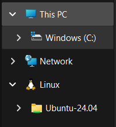
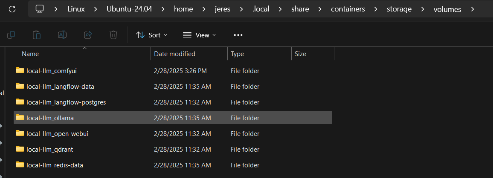

# Local LLM

To use this repo, you need a system with a GPU, podman and nvidia container toolkit packages installed on your system. Review the podman documentation links below.

## Testing your system

Before starting make sure podman containers have GPU access.
Follow the instruction from the links below.

https://docs.nvidia.com/datacenter/cloud-native/container-toolkit/latest/install-guide.html

https://podman-desktop.io/docs/podman/gpu

You also need to use `podman-compose` not `docker-compose`

podman-compose version >= 1.2.0

https://github.com/containers/podman-compose#installation

docker-compose with podman does not pass the GPU to the container.

---

## Windows Setup

Use WSL2 to run podman. I recommend using Ubuntu 24.04.

To install WSL2 run the following command in a power shell or cmd terminal as an administrator.
This will also install a Ubuntu vm.

```bash
wsl --install
```

Open a new WSL terminal and run the following command to start Ubuntu 24.04.

To install Ubuntu 24.04 in a wsl, run the following command. In a power shell or cmd terminal as an administrator run the following command.

```bash
wsl --install --name local-llm -d Ubuntu-24.04
```

To start Ubuntu 24.04 run the following command.

```bash
wsl -d local-llm
```

> [!WARNING]
> If you want to remove / uninstall the Ubuntu 24.04 distribution run the following command. This will also remove the volumes and any data / models.
>
> ```bash
> wsl --unregister local-llm
> ```

Accessing the volumes from Windows is a bit tricky. You can use Explore to find the volumes under Linux on the left side of the window and browse the WSL filesystem for Ubuntu-24.04.



Volume are in the following path in the WSL filesystem. `/home/USERNAME/.local/share/containers/storage/volumes/VOLUME-NAME` Where `USERNAME` is your Windows username and `VOLUME-NAME` is the name of the volume.



Clone the repo

```bash
git clone https://github.com/jrespeto/Local-LLM.git
```

The version of podman-compose in the Ubuntu 24.04 repo is 1.0.6 and does not work with this compose file. You need to install the latest version of podman-compose from github using the following command as mentioned above.
You also need to install python3-dotenv and the nvidia-container-toolkit using the following commands.

> [!WARNING]
> When updating your system drivers, you may need to regenerate the nvidia.yaml by rerunning the `nvidia-ctk cdi generate --output=/etc/cdi/nvidia.yaml` below.

```bash

sudo su -
# podman-compose
curl -o /usr/local/bin/podman-compose https://raw.githubusercontent.com/containers/podman-compose/main/podman_compose.py
chmod +x /usr/local/bin/podman-compose

# nvidia-container-toolkit repo
curl -fsSL https://nvidia.github.io/libnvidia-container/gpgkey | gpg --dearmor -o /usr/share/keyrings/nvidia-container-toolkit-keyring.gpg && curl -s -L https://nvidia.github.io/libnvidia-container/stable/deb/nvidia-container-toolkit.list | sed 's#deb https://#deb [signed-by=/usr/share/keyrings/nvidia-container-toolkit-keyring.gpg] https://#g' | tee /etc/apt/sources.list.d/nvidia-container-toolkit.list

# installing nvidia-container-toolkit and python3-dotenv
apt update && apt install -y nvidia-container-toolkit python3-dotenv podman

# generate cdi yaml file for the GPU
nvidia-ctk cdi generate --output=/etc/cdi/nvidia.yaml
nvidia-ctk cdi list

# logout of root
exit
```

### Test NVIDIA GPU

Inside the WSL environment, run the following command to test the NVIDIA GPU:

```bash
podman run --rm --device nvidia.com/gpu=all docker.io/nvidia/cuda:12.8.0-runtime-ubuntu24.04 nvidia-smi
```

It should output data like this show details about your GPU.

```bash
Trying to pull docker.io/nvidia/cuda:12.8.0-base-ubuntu20.04...
Getting image source signatures
Copying blob 4b650590013c skipped: already exists
Copying blob d9802f032d67 skipped: already exists
Copying blob b4aeb03891f2 done   |
Copying blob a8163c471214 done   |
Copying blob e43bfa99a834 done   |
Copying config dd22839602 done   |
Writing manifest to image destination
Mon Mar 10 13:52:08 2025
+-----------------------------------------------------------------------------------------+
| NVIDIA-SMI 570.124.06             Driver Version: 570.124.06     CUDA Version: 12.8     |
|-----------------------------------------+------------------------+----------------------+
| GPU  Name                 Persistence-M | Bus-Id          Disp.A | Volatile Uncorr. ECC |
| Fan  Temp   Perf          Pwr:Usage/Cap |           Memory-Usage | GPU-Util  Compute M. |
|                                         |                        |               MIG M. |
|=========================================+========================+======================|
|   0  NVIDIA GeForce RTX 4070 ...    Off |   00000000:01:00.0 Off |                  N/A |
| N/A   51C    P8              2W /   35W |      16MiB /   8188MiB |      0%      Default |
|                                         |                        |                  N/A |
+-----------------------------------------+------------------------+----------------------+

+-----------------------------------------------------------------------------------------+
| Processes:                                                                              |
|  GPU   GI   CI              PID   Type   Process name                        GPU Memory |
|        ID   ID                                                               Usage      |
|=========================================================================================|
|  No running processes found                                                             |
+-----------------------------------------------------------------------------------------+

```

### Running the Compose File

To start the containers with the below command in the [Running](#running) section in the WSL environment.

---

## Tech Stack

This compose has 8 containers.
To start all the containers, run the following command: --profile all

- [openWebUI](https://docs.openwebui.com) - chatbot/ API's to ollama
  - --profile openwebui
  - [localhost:8080](http://localhost:8080)
- [ollama](https://ollama.com) - LLM management
  - no ui ollama:11434
- [qdrant](https://qdrant.tech) - Vector store and AI RAGs
  - [localhost:6333](http://localhost:6333)
- [Langflow](https://langflow.org) - low code framwork to build AI workflows and agents
  - --profile langflow
  - [localhost:7860](http://localhost:7860)
- [postgresql](https://www.postgresql.org/) - DB dep for Langflow
  - no ui postgres:5432
- [searxng](https://docs.searxng.org) - local internet metasearch engine
  - --profile searxng
  - [localhost:8082](http://localhost:8082)
- [valkey](https://valkey.io/) - redis cache dep for searxng
  - no ui valkey:6379
- [comfyui](https://comfy.org) - image generation flamwork
  - --profile comfyui
  - [localhost:8188](http://localhost:8188)
---

## Running

To start the containers with the profile of the app or all apps

`podman-compose --profile openwebui --profile langflow up -d`

`podman-compose --profile all up -d`

To start up the containers and comfyui

First build the comfyui container

`podman-compose --profile comfyui build`

`podman-compose --profile comfyui up -d`

To follow the logs

`podman-compose logs --follow`

To stop

`podman-compose down`

To working with volums from the containers

`podman volume ls` - list all the volums

`podman volume inspect volume_name` - this lets you see the mount points

`podman volume rm volume_name` - this is to remove the volume

## ComfyUI

You may need to update the FROM line in docker/dockerfile.comfyui for your systems version of cuda.

Watch the youtube links below on how to setup and use ComfyUI.

I do recommend joining the [Pixaroma Discord](https://discord.gg/arycS8aq)

The `entrypoint.sh` for comfyui installs a few custom nodes listed below. Mostly from me following along the [ComfyUI Tutorial Series](https://www.youtube.com/playlist?list=PL-pohOSaL8P9kLZP8tQ1K1QWdZEgwiBM0) from [pixaroma](https://www.youtube.com/@pixaroma).

> [!NOTE]
> The 300+ Art styles are added here from [EP.07](https://www.youtube.com/watch?v=Xsx-u0OMezw)

> [!NOTE]
> TODO: add links to video next to node.

- ComfyUI-Manager [EP.01](https://www.youtube.com/watch?v=Zko_s2LO9Wo)
- was-node-suite-comfyui [EP.07](https://www.youtube.com/watch?v=Xsx-u0OMezw)
- ComfyUI-Easy-Use [EP.07](https://www.youtube.com/watch?v=Xsx-u0OMezw)
- ComfyUI-GGUF [EP.10](https://www.youtube.com/watch?v=Ym0oJpRbj4U)
- ComfyUI-Crystools [EP.10](https://www.youtube.com/watch?v=Ym0oJpRbj4U)
- rgthree-comfy [EP.10](https://www.youtube.com/watch?v=Ym0oJpRbj4U)
- comfyui-ollama [EP.13](https://www.youtube.com/watch?v=eK6MXm7q37)
- ComfyUI_UltimateSDUpscale
- comfyui_controlnet_aux
- ComfyUI_Comfyroll_CustomNodes

## openwebui

This will allow you to use comfyui to generate images with a default workflow.

ComfyUI is very advanced and can do way more then just image generation.

To intergrate ComfyUI with openwebUI you need to update the image setting under Admin settings.


If you update the "ComfyUI Workflow" you need to updated the "ComfyUI Workflow Nodes".

i.e - node 3 is the object with seed and steps

You also need to set a default Model. Watch the video's and playlist below to understand which models "depending on  the ammount of vram on your GPU" and settings to use.

### Reference Youtube

- [pixaroma](https://www.youtube.com/@pixaroma)
- [ComfyUI Tutorial Series](https://www.youtube.com/playlist?list=PL-pohOSaL8P9kLZP8tQ1K1QWdZEgwiBM0)
