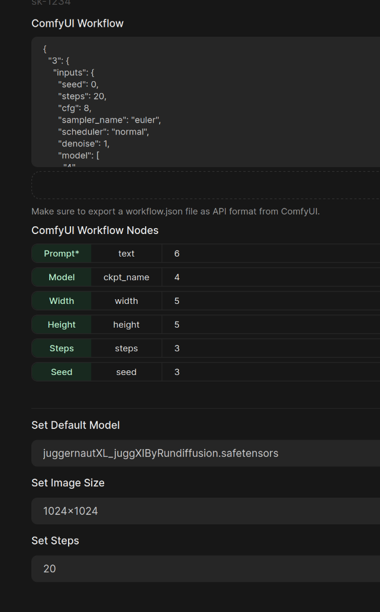

# Local LLM

To use this repo, you need a system with a GPU, podman and nvidia container toolkit packages installed on your system. Review the podman documentation links below.

## Testing your system

Before starting make sure podman containers have GPU access.
Follow the instruction from the links below.

https://docs.nvidia.com/datacenter/cloud-native/container-toolkit/latest/install-guide.html

https://podman-desktop.io/docs/podman/gpu

You also need to use `podman-compose` not `docker-compose`

podman-compose version >= 1.2.0

https://github.com/containers/podman-compose#installation

docker-compose with podman does not pass the GPU to the container.

### Windows Setup

Use WSL to run podman. I recommend using Ubuntu 24.04.

Open a new WSL terminal and run the following command to start Ubuntu 24.04.

```bash
wsl -d Ubuntu-24.04
```

Clone the repo

```bash
git clone https://github.com/jrespeto/Local-LLM.git
```

The version of podman-compose in the Ubuntu 24.04 repo is 1.0.6 and does not work with this compose file. You need to install the latest version of podman-compose from github using the following command as mentioned above.
You also need to install python3-dotenv and the nvidia-container-toolkit using the following commands.

```bash

sudo su -
# podman-compose
curl -o /usr/local/bin/podman-compose https://raw.githubusercontent.com/containers/podman-compose/main/podman_compose.py
chmod +x /usr/local/bin/podman-compose

# nvidia-container-toolkit repo
curl -fsSL https://nvidia.github.io/libnvidia-container/gpgkey | sudo gpg --dearmor -o /usr/share/keyrings/nvidia-container-toolkit-keyring.gpg && curl -s -L https://nvidia.github.io/libnvidia-container/stable/deb/nvidia-container-toolkit.list | sed 's#deb https://#deb [signed-by=/usr/share/keyrings/nvidia-container-toolkit-keyring.gpg] https://#g' |     sudo tee /etc/apt/sources.list.d/nvidia-container-toolkit.list

# installing nvidia-container-toolkit and python3-dotenv
apt update && apt install -y nvidia-container-toolkit python3-dotenv

# generate cdi yaml file for the GPU
nvidia-ctk cdi generate --output=/etc/cdi/nvidia.yaml
nvidia-ctk cdi list

# logout of root
exit
```

#### Test NVIDIA GPU

Inside the WSL environment, run the following command to test the NVIDIA GPU:

```bash
podman run --rm --device nvidia.com/gpu=all docker.io/nvidia/cuda:12.8.0-runtime-ubuntu24.04 nvidia-smi
```

#### Running the Compose File

To start the containers with the below command in the [Running](#running) section in the WSL environment.

## Tech Stack

This compose has 8 containers.

- [openWebUI](https://docs.openwebui.com) - chatbot/ API's to ollama
  - [localhost:8080](http://localhost:8080)
- [ollama](https://ollama.com) - LLM management
  - no ui ollama:11434
- [qdrant](https://qdrant.tech) - Vector store and AI RAGs
  - [localhost:6333](http://localhost:6333)
- [Langflow](https://langflow.org) - low code framwork to build AI workflows and agents
  - [localhost:7860](http://localhost:7860)
- [postgresql](https://www.postgresql.org/) - DB dep for Langflow
  - no ui postgres:5432
- [searxng](https://docs.searxng.org) - local internet metasearch engine
  - [localhost:8082](http://localhost:8082)
- [valkey](https://valkey.io/) - redis cache dep for searxng
  - no ui valkey:6379
- [comfyui](https://comfy.org) - image generation flamwork
  - [localhost:8188](http://localhost:8188)
---

## Running

To start the containers without comfyui

`podman-compose up -d`

To start up the containers and comfyui

First build the comfyui container

`podman-compose --profile comfyui build`

`podman-compose --profile comfyui up -d`

To follow the logs

`podman-compose logs --follow`

To stop

`podman-compose down`

To working with volums from the containers

`podman volume ls` - list all the volums

`podman volume inspect volume_name` - this lets you see the mount points

`podman volume rm volume_name` - this is to remove the volume

## ComfyUI

You may need to update the FROM line in docker/dockerfile.comfyui for your systems version of cuda.

Watch the youtube links below on how to setup and use ComfyUI. Set the play speep to 1.5 :)

### openwebui

This will allow you to use comfyui to generate images with a default workflow.

ComfyUI is very advanced and can do way more then just image generation.

To intergrate ComfyUI with openwebUI you need to update the image setting under Admin settings.



If you update the "ComfyUI Workflow" you need to updated the "ComfyUI Workflow Nodes".

i.e - node 3 is the object with seed and steps

You also need to set a default Model. Watch the video's and playlist below to understand which models "depending on  the ammount of vram on your GPU" and settings to use.

#### References Repos

- https://github.com/Teachings/AIServerSetup

#### Reference Youtube

- https://www.youtube.com/watch?v=Z914egVyXBw
- https://www.youtube.com/playlist?list=PL-pohOSaL8P9kLZP8tQ1K1QWdZEgwiBM0
